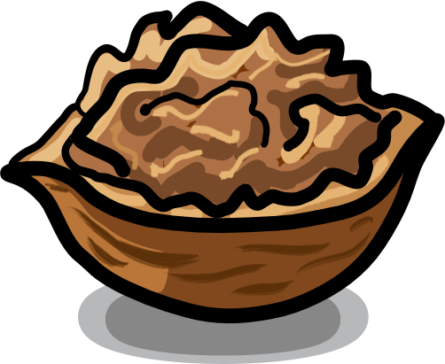

# NUT (Native UI Toolkit) [](https://travis-ci.org/s1hofmann/native-ui-toolkit)
<p align="center">
Native UI testing / controlling with node.js
</p>
<br/>
<p align="center">
	<a target="_blank" href="http://getrobot.net">
		
	</a>
	<a target="_blank" href="https://github.com/justadudewhohacks/opencv4nodejs">
		
</p>

# About

<p align="center">
    
</p>

This is a WIP implementation for a cross-platform native UI testing tool.
It allows for native UI interactions via keyboard and / or mouse,
but additionally gives you the possibility to navigate the screen based on image matching.

# Sample

The following snippet shows a valid NUT example (on macOS)

```js
"use strict";

const native = require("native-ui-toolkit");

const square = async (control) => {
    await control.mouse.move(control.movement.right(500));
    await control.mouse.move(control.movement.down(500));
    await control.mouse.move(control.movement.left(500));
    await control.mouse.move(control.movement.up(500));
};

const openSpotlight = async (control) => {
    await control.keyboard.pressKey(native.Key.LeftSuper);
    await control.keyboard.pressKey(native.Key.Space);
    await control.keyboard.releaseKey(native.Key.Space);
    await control.keyboard.releaseKey(native.Key.LeftSuper);
}

describe("Basic test", () => {
    it("Should run a simple test", async () => {
        const config = new native.Config();
        const control = new native.Controller(config);

        await square(control);
        await openSpotlight(control);
        await control.keyboard.type("calculator");
        await control.keyboard.type(native.Key.Return);
    });
});

```

# Examples

The [nuts](https://github.com/s1hofmann/nuts) contains a set of ready to use examples which demo the usage ot NUT.

# Modules

This list gives an overview on currently implemented and planned functionality.
It's work in progress and will undergo constant modification.

## Assertions

- [x] isVisible
- [x] isNotVisible

## Clipboard

- [ ] Copy to clipboard
- [ ] Paste from clipboard

## Keyboard

- [x] Support for standard US keyboard layout
- [ ] Support for German keyboard layout

## Mouse

- [x] Support for basic mouse movement
- [x] Configurable movement speed

## Process

- [ ] Spawn a new process
- [ ] Retrieve the region of a process window
- [ ] Close a spawned process

## Screen

- [x] findOnScreen
- [ ] waitFor
- [ ] Hooks to trigger actions based on images
